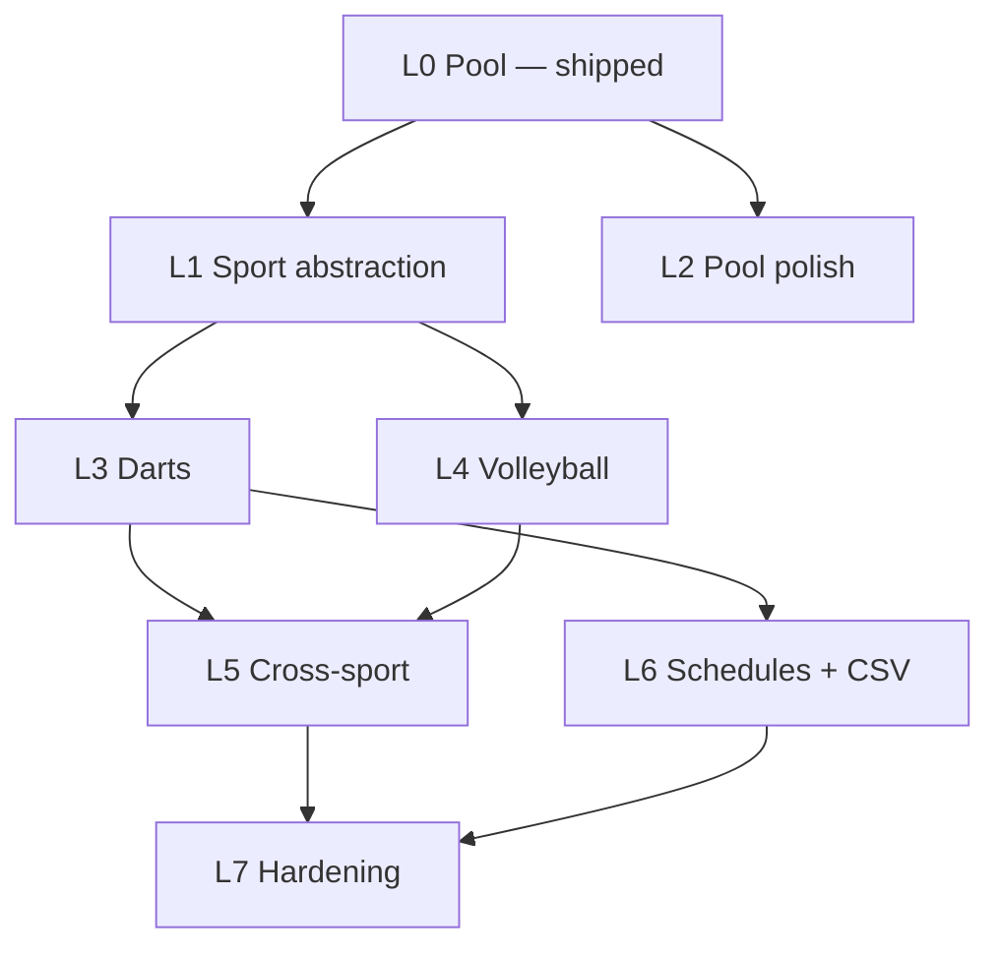

# Multi-Sport Leagues — Phased Build Prompt Sequences

**Module:** Leagues (pool · darts · volleyball)  
**Status:** Phase L0 (Pool) **shipped** — prompts below cover the **remainder**  
**Last updated:** June 2026

Paste the relevant prompt into Cursor chat with **`docs/contexts/CONTEXT_leagues.md`** or **`claude-files/CONTEXT_leagues.md`** attached (and `.cursorrules` / `AGENTS.md` as usual).

Each prompt is self-contained: what to build, which files to touch, acceptance criteria.

**Product plan:** [LEAGUES.md](../docs/LEAGUES.md) · **Schemas:** [leagues/SCHEMAS.md](../docs/leagues/SCHEMAS.md)

---

## Quick reference

| Phase | Prompt | What it builds |
|-------|--------|----------------|
| **L0** | — | Pool foundation *(complete — reference only)* |
| **L1** | L1.1 | Sport-aware scoresheet + finalization router |
| **L2** | L2.1 | Pool format UI (8-ball / 9-ball) |
| **L2** | L2.2 | APA/VNEA handicap scaffolding *(optional)* |
| **L3** | L3.1 | Darts models + `DartsStandingsEngine` |
| **L3** | L3.2 | Darts scoresheet + captain/admin UI |
| **L4** | L4.1 | Volleyball models + `VolleyballStandingsEngine` |
| **L4** | L4.2 | Volleyball scoresheet + captain/admin UI |
| **L5** | L5.1 | `league_admin` role + route gating |
| **L5** | L5.2 | Captain Auth0 invite / onboarding |
| **L5** | L5.3 | Venue leagues dashboard (all sports) |
| **L5** | L5.4 | Player self-service portal |
| **L5** | L5.5 | Homepage leagues preview section |
| **L6** | L6.1 | Ladder + bracket schedule generators |
| **L6** | L6.2 | CompuSport CSV column mapping *(when sample available)* |
| **L6** | L6.3 | CSV historical results import |
| **L7** | L7.1 | Establishment module enforcement |
| **L7** | L7.2 | Docs + AGENTS.md update |
| **L7** | L7.3 | Standings / scoresheet integration tests |

**Recommended order:** L1 → L3 → L4 → L5 → L2/L6/L7 as needed.

**Branch convention:** `feat/leagues-l{N}-{short-name}`

---

## PHASE L0: Pool Foundation — COMPLETE

**Goal:** End-to-end native pool league without CompuSport.

**Shipped (do not rebuild):**

- Models: `server/src/models/leagues/*`
- Admin: `/admin/leagues`, `/admin/leagues/:id` — CRUD, schedule gen, standings, disputes, CSV import
- Captain: `/captain` — dual-entry pool scoresheets
- Public: `/leagues`, `/leagues/:leagueId`
- `PoolStandingsEngine`, round-robin schedule, `POST .../import`

**Verify before starting L1:**

```bash
npm run dev
# Admin: create pool league → divisions → teams → captains → generate schedule
# Captain: submit matching scoresheets → standings update
# Public: /leagues shows league
```

---

## PHASE L1: Sport Abstraction Layer

**Goal:** Refactor pool-specific scoresheet logic so darts and volleyball plug in without copy-paste. **Required before L3/L4.**

**Estimated time:** 2–3 hours  
**Branch:** `feat/leagues-l1-scoresheet-router`

---

### Prompt L1.1 — Sport-aware scoresheet router

```
Read docs/contexts/CONTEXT_leagues.md and server/src/services/leagues/scoresheet.ts.

Pool scoresheet validation and finalization are hardcoded. Refactor into a sport-pluggable 
router so L3 (darts) and L4 (volleyball) only add new validators + engines.

1. CREATE server/src/services/leagues/scoresheets/ directory:
   - types.ts — ScoresheetPayloadValidator interface:
       sport: Sport
       validate(payload: unknown): Record<string, unknown>
       payloadsMatch(a: Record<string, unknown>, b: Record<string, unknown>): boolean
       toMatchResult(match: IMatch, payload: Record<string, unknown>): IMatchResult
   - pool.ts — move PoolScoresheetPayload, validatePoolScoresheetPayload, 
     pool payloadsMatch, pool toMatchResult from scoresheet.ts
   - index.ts — getScoresheetValidator(sport: Sport): ScoresheetPayloadValidator
       pool → pool validator
       darts/volleyball → throw clear "not implemented" until L3/L4

2. UPDATE server/src/services/leagues/scoresheet.ts:
   - Import getScoresheetValidator instead of inline pool logic
   - evaluateScoresheets: use validator.payloadsMatch + validator.toMatchResult
   - finalizeMatchFromPayload: accept sport + generic payload via validator
   - Export pool types from pool.ts for backward compatibility

3. UPDATE server/src/routes/leagues/captain.ts and admin.ts resolve handler:
   - Load match.sport before validating payload
   - Use getScoresheetValidator(match.sport).validate(...)

4. UPDATE client types:
   - client/src/types/captain.ts — add SportScoresheetPayload union (pool today)
   - Keep PoolScoresheetPayload exported; captain UI unchanged for pool

5. ADD minimal unit-style tests OR a dev script that asserts:
   - pool validator rejects invalid payloads
   - pool validator payloadsMatch works for matching/differing scores

Do NOT implement darts/volleyball validators yet — only the router + pool migration.

Acceptance criteria:
- Existing pool captain workflow unchanged (submit → confirm → final → standings)
- Dispute flow still works
- npm run build passes in client and server
- getScoresheetValidator('darts') throws a clear error (not pool validation)
- No duplicate pool validation logic outside pool.ts
```

---

## PHASE L2: Pool Polish (1.1)

**Goal:** Expose deferred pool features for pilot bars that need format or handicap support.

**Branch:** `feat/leagues-l2-pool-polish`  
**Note:** L2.2 is optional — skip if pilot bar runs simple 8-ball team race only.

---

### Prompt L2.1 — Pool format admin + match fields

```
Read docs/leagues/SCHEMAS.md (PoolMatch section) and LeagueDetailPage.tsx.

poolFormat exists on PoolMatch discriminator but is not set in UI or schedule generator.

1. UPDATE admin league create/edit (AdminLeaguesPage or LeagueDetailPage):
   - When sport === 'pool', show format dropdown: 8-Ball / 9-Ball
   - Store on league or default per match — prefer setting poolFormat on each 
     PoolMatch at schedule generation time from league-level default

2. UPDATE server schedule generator (roundRobin.ts or admin route):
   - Accept optional poolFormat param
   - When creating PoolMatch documents, set poolFormat ('8_ball' | '9_ball')

3. UPDATE public LeaguePublicPage match list:
   - Show small badge "8-Ball" or "9-Ball" on pool matches when poolFormat set

4. UPDATE docs/leagues/SCHEMAS.md — mark poolFormat as @implemented

Acceptance criteria:
- New pool league can default to 8_ball or 9_ball
- Generated matches carry poolFormat
- Public schedule shows format badge
- Existing leagues without poolFormat still render (no crash)
```

---

### Prompt L2.2 — APA/VNEA handicap scaffolding (optional)

```
Read Division.handicapRules in server/src/models/leagues/Division.ts.

Handicap math is deferred but pilot bars may need to STORE rules before v1.1 math ships.

1. DEFINE TypeScript interface in server/src/types/leagues.ts (or constants):
   PoolHandicapRules { system: 'apa' | 'vnea' | 'none'; skillLevelRange?: [number, number]; 
     handicapPerSkillLevel?: number }

2. UPDATE admin division form on LeagueDetailPage:
   - Optional "Handicap system" dropdown: None / APA / VNEA
   - When not None, show numeric fields for skill level range and points per level
   - PATCH division with typed handicapRules object

3. UPDATE server division PATCH validation:
   - Validate handicapRules shape when present; reject unknown systems

4. DO NOT change PoolStandingsEngine yet — storage + admin UI only
   - Add comment in PoolStandingsEngine: "// TODO: apply handicapRules in v1.1"

5. UPDATE SCHEMAS.md — mark PoolHandicapRules as @implemented (storage), 
   standings application as @planned

Acceptance criteria:
- Division can save and reload handicap rules
- Standings unchanged (still W-L-T only)
- Invalid handicap payload returns 400
```

---

## PHASE L3: Darts Module

**Goal:** Runnable end-to-end darts league using shared infrastructure.

**Prerequisite:** Phase L1 complete.  
**Default format:** Team legs (501-style race — `{ homeLegsWon, awayLegsWon }`) — simplest bar format.  
**Branch:** `feat/leagues-l3-darts`

---

### Prompt L3.1 — Darts models + standings engine

```
Read docs/leagues/SCHEMAS.md planned DartsMatch section and PoolStandingsEngine.ts.

1. EXTEND server/src/models/leagues/Match.ts:
   - IDartsMatch interface: dartsFormat: '501' | '301' | 'cricket'; legsToWin?: number; 
     isDoubles?: boolean
   - DartsMatch discriminator on Match model (sport key 'darts')
   - Export from models/leagues/index.ts

2. CREATE server/src/services/leagues/standings/DartsStandingsEngine.ts:
   - Same points rules as pool for v1: W=2, T=1, rank by points → wins → fewer losses
   - homeScore/awayScore from match.result = legs won
   - Implement StandingsEngine interface

3. UPDATE server/src/services/leagues/standings/index.ts:
   - case 'darts': return dartsStandingsEngine

4. UPDATE admin league create + schedule generate:
   - When sport === 'darts', create DartsMatch documents (default dartsFormat: '501', 
     legsToWin: 2 for team race)
   - Reject schedule generate for darts if league.format !== 'round_robin' (same as pool)

5. UPDATE docs/leagues/SCHEMAS.md — DartsMatch @implemented, DartsStandingsEngine @implemented

Acceptance criteria:
- Admin can create darts league, divisions, teams, generate round-robin schedule
- Manual DB finalization OR admin resolve produces standings via DartsStandingsEngine
- GET /api/leagues/:id/standings works for darts league
- npm run build passes
```

---

### Prompt L3.2 — Darts scoresheet + captain/admin UI

```
Prerequisite: L1.1 scoresheet router + L3.1 models.

1. CREATE server/src/services/leagues/scoresheets/darts.ts:
   - DartsScoresheetPayload: { homeLegsWon: number; awayLegsWon: number }
   - validate, payloadsMatch, toMatchResult (mirror pool.ts structure)

2. WIRE into scorersheets/index.ts getScoresheetValidator('darts')

3. UPDATE client/src/types/captain.ts — DartsScoresheetPayload

4. REFACTOR client/src/pages/captain/CaptainPage.tsx:
   - Fetch match.sport from captain matches API (add sport to response if missing)
   - Render PoolScoresheetForm OR DartsScoresheetForm based on sport
   - Darts form labels: "Our legs won" / "Their legs won" (same home/away semantics as pool)

5. UPDATE LeagueDetailPage dispute resolver:
   - Sport-aware resolve form (legs won fields for darts)

6. UPDATE public LeaguePublicPage:
   - Match results show "X–Y legs" for darts

Acceptance criteria:
- Full darts loop: captain dual-entry → final → standings
- Dispute + admin resolve works for darts
- Pool captain flow regression-free
- Captain cannot submit pool payload to darts match (400)
```

---

## PHASE L4: Volleyball Module

**Goal:** Runnable end-to-end volleyball league — primary greenfield pitch sport.

**Prerequisite:** Phase L1 complete.  
**Default:** Best of 3 sets (`setsToWin: 2`).  
**Branch:** `feat/leagues-l4-volleyball`

---

### Prompt L4.1 — Volleyball models + standings engine

```
Read docs/leagues/SCHEMAS.md planned VolleyballMatch section.

1. EXTEND server/src/models/leagues/Match.ts:
   - IVolleyballMatch: setsToWin: 2 | 3 (best of 3 or 5)
   - VolleyballMatch discriminator (sport key 'volleyball')

2. CREATE server/src/services/leagues/standings/VolleyballStandingsEngine.ts:
   - W-L-T points same as pool/darts v1
   - Match result: homeScore/awayScore = sets won by each team

3. UPDATE standings/index.ts — case 'volleyball'

4. UPDATE admin schedule generate for volleyball:
   - Default setsToWin: 2
   - Optional admin field on league detail when sport is volleyball

5. UPDATE SCHEMAS.md

Acceptance criteria:
- Volleyball league schedule generates VolleyballMatch documents
- Standings compute from finalized matches
- Public standings API works
```

---

### Prompt L4.2 — Volleyball scoresheet + captain/admin UI

```
Prerequisite: L1.1 + L4.1.

1. CREATE server/src/services/leagues/scoresheets/volleyball.ts:
   - VolleyballScoresheetPayload: { homeSetWins: number; awaySetWins: number }
   - Validation: one team must reach setsToWin from match document (load match for validate)
   - toMatchResult: homeScore/awayScore = set wins

2. WIRE validator into router

3. UPDATE CaptainPage — VolleyballScoresheetForm ("Our sets won" / "Their sets won")

4. UPDATE LeagueDetailPage dispute resolver for volleyball

5. UPDATE public match display — "X–Y sets" label

Acceptance criteria:
- Full volleyball captain loop works
- Validation rejects impossible scores (e.g. 2–2 when setsToWin=2 and match should end 2–0, 2–1)
- Pool and darts regression-free
```

---

## PHASE L5: Cross-Sport Venue Features

**Goal:** Multi-sport venue experience and production-ready auth.

**Branch:** `feat/leagues-l5-cross-sport`

---

### Prompt L5.1 — `league_admin` role + route gating

```
Read server/src/middleware/requireRole.ts and routes/leagues/admin.ts.

league_admin exists on User model but all league admin routes only use checkJwt.

1. CREATE server/src/middleware/requireLeagueAdmin.ts OR extend requireRole:
   - Allows manager OR league_admin
   - staff → 403 on league write routes

2. APPLY to server/src/routes/leagues/admin.ts router:
   - GET routes: manager | staff | league_admin (read)
   - POST/PATCH/DELETE/import/resolve/recalculate: manager | league_admin only

3. UPDATE admin sidebar:
   - Leagues nav visible to league_admin users
   - Hide site settings pages from league_admin (Overview ok if read-only)

4. UPDATE seed script or document assigning league_admin role in SETUP_AUTH0.md

5. Admin UI: when user is league_admin, hide sportsEnabled toggle on AdminLeaguesPage 
   (managers only) — or return 403 from API if league_admin attempts PUT site settings

Acceptance criteria:
- league_admin can CRUD leagues, resolve disputes, import CSV
- league_admin cannot PUT /api/admin/site
- staff can view leagues but not create/delete
- manager retains full access
```

---

### Prompt L5.2 — Captain Auth0 invite / onboarding

```
Today captains require manual auth0Sub paste in admin or seedCaptain.ts.

1. ADD admin action on LeagueDetailPage team row: "Invite captain"
   - Requires captain email on Player record
   - POST /api/admin/leagues/:leagueId/teams/:teamId/invite-captain
   - Server: create or update User { role: 'captain', playerId, email }
   - Phase 1 approach (no Auth0 Management API): generate magic link instructions
     OR document Auth0 invitation workflow in SETUP_AUTH0.md with step-by-step

2. IF implementing Auth0 Management API (optional, env-gated):
   - AUTH0_MGMT_CLIENT_ID, AUTH0_MGMT_CLIENT_SECRET
   - Create user + send passwordless/email invite
   - On first login, link auth0Sub to User record

3. UPDATE captain login page copy: "Use the email your league manager invited"

4. Handle existing captain with auth0Sub — invite button disabled, show "Linked"

Acceptance criteria:
- Documented path from team captain email → captain can log in at /captain/login
- Captain sees only their team's matches after login
- No regression for manually seeded captains
```

---

### Prompt L5.3 — Venue leagues dashboard (all sports)

```
Create a unified admin view of all leagues across sports.

1. CREATE client/src/pages/admin/LeaguesOverviewPage.tsx (or enhance AdminLeaguesPage):
   - Summary cards: active leagues by sport, disputed matches count, upcoming matches this week
   - Table: all leagues with sport badge, status, division count, disputed count
   - Quick links to /admin/leagues/:id

2. ADD server endpoint GET /api/admin/leagues/overview:
   - { activeBySport, disputedMatches, upcomingMatchCount, leagues: [...] }

3. ADD route /admin/leagues overview as index or separate /admin/leagues-dashboard
   - Prefer making AdminLeaguesPage the hub with summary section at top

Acceptance criteria:
- Manager sees pool + darts + volleyball leagues in one list
- Disputed matches surface with link to resolve on league detail
- Empty state friendly when no leagues
```

---

### Prompt L5.4 — Player self-service portal

```
Phase 4 player registration — lightweight v1.

1. EXTEND Player model usage:
   - Player.auth0Sub optional for non-captain players
   - role: 'player' on User OR use captain role only for scoresheet duties (simpler: 
     new role 'player' with read-only league access)

2. CREATE public/authenticated routes:
   GET /api/player/leagues — leagues where playerId in any team.playerIds
   GET /api/player/leagues/:id/standings — read-only

3. CREATE client/src/pages/player/PlayerPage.tsx:
   - /player — list my leagues across sports
   - Standings read-only per league
   - No scoresheet submit (captains only)

4. Admin: optional "Invite player" email on roster row (future registration)

Acceptance criteria:
- Player with linked User can see leagues they belong to
- Cannot access captain submit or admin routes
- Works for player in both pool and darts leagues at same venue
```

---

### Prompt L5.5 — Homepage leagues preview section

```
Mirror EventsSection pattern for leagues on the public homepage.

1. CREATE client/src/components/public/LeaguesSection/index.tsx:
   - usePublicLeagues() hook — fetch GET /api/leagues (limit 3 active)
   - If leagues.length > 0: show 2–3 league cards with sport badge + link to /leagues/:id
   - If empty: return null (no section — leagues are optional module)
   - Link "All leagues →" to /leagues

2. ADD to HomePage.tsx after EventsSection (or before footer)

3. Style consistent with EventsSection / dark pub theme

Acceptance criteria:
- Homepage shows leagues only when active leagues exist
- No error state when leagues disabled or empty
- Mobile responsive
```

---

## PHASE L6: Schedule Formats + Migration

**Goal:** Advanced formats and CompuSport migration when samples exist.

**Branch:** `feat/leagues-l6-schedules-migration`  
**Note:** L6.2 blocked until real CompuSport export from pilot bar.

---

### Prompt L6.1 — Ladder + bracket schedule generators

```
round_robin is implemented. ladder and bracket are selectable but unsupported.

1. CREATE server/src/services/leagues/schedule/ladder.ts:
   - Input: teamIds[], startDate, weeksBetweenRounds
   - Output: matches with roundNumber incrementing; bottom vs top pairing pattern

2. CREATE server/src/services/leagues/schedule/bracket.ts:
   - Single-elimination bracket for N teams (pad to power of 2 with byes)
   - Assign scheduledAt per round

3. UPDATE POST .../schedule/generate:
   - Switch on league.format: round_robin | ladder | bracket
   - Return 400 with clear message if team count invalid for bracket

4. UPDATE LeagueDetailPage:
   - Enable Generate Schedule for ladder/bracket with explanation copy
   - Disable or warn when team count < 2

5. UPDATE LEAGUES.md and SCHEMAS.md

Acceptance criteria:
- Each format generates matches with valid team pairings
- Existing round_robin unchanged
- Admin UI shows which format is active
```

---

### Prompt L6.2 — CompuSport CSV column mapping

```
BLOCKED until a real CompuSport export is available. When sample arrives:

Read docs/leagues/CSV_IMPORT.md.

1. ADD server/src/services/leagues/import/compusportAliases.ts:
   - Map CompuSport column headers → canonical import columns
   - Unit test with anonymized sample CSV committed to server/src/__fixtures__/

2. UPDATE csvImport.ts:
   - detectImportFormat(headers): 'canonical' | 'compusport'
   - Auto-apply alias mapping before validation

3. UPDATE CSV_IMPORT.md with real column names and example rows

4. UPDATE admin import UI — show detected format label

Acceptance criteria:
- Pilot bar CompuSport export imports without manual column renaming
- Canonical CSV still works
- No PII in committed fixtures
```

---

### Prompt L6.3 — CSV historical results import

```
Extend import to backfill finalized matches + standings.

1. ADD results.csv support to CSV_IMPORT.md:
   Columns: divisionName, homeTeamName, awayTeamName, scheduledAt, homeScore, awayScore, status

2. UPDATE csvImport.ts:
   - Import results rows as Match status=final with result
   - Skip if match already exists (idempotent by teams + date)
   - After import: trigger recomputeStandingsForLeague

3. UPDATE admin import UI — checkbox "Import match results (historical)"

Acceptance criteria:
- Import historical results → standings reflect imported wins/losses
- Does not overwrite existing finalized matches
- Dispute workflow not triggered for imported finals
```

---

## PHASE L7: Platform Hardening

**Goal:** Licensing enforcement, documentation, automated confidence.

**Branch:** `feat/leagues-l7-hardening`

---

### Prompt L7.1 — Establishment module enforcement

```
Read config/establishment.json modules.leagues pattern.

sportsEnabled is staff-controlled but licensing tier is not enforced server-side.

1. CREATE server/src/config/establishment.ts (or extend existing):
   - Load establishment.json at boot
   - modules.leagues: { pool: boolean, darts: boolean, volleyball: boolean }

2. CREATE middleware or helper assertSportLicensed(sport):
   - POST create league: reject if sport not licensed
   - PUT sportsEnabled: cannot enable sport not in license
   - Public GET /api/leagues: filter to licensed sports

3. Admin UI: sportsEnabled toggles disabled with tooltip when sport not licensed

4. UPDATE establishment.example.json with modules.leagues example

Acceptance criteria:
- Deployment with pool-only license cannot create darts league via API
- Staff cannot enable unlicensed sport in dashboard
- Licensed sports work as today
```

---

### Prompt L7.2 — Docs + AGENTS.md update

```
League module shipped but core docs are stale.

1. UPDATE docs/LEAGUES.md status section — Phase L0 complete, link to LEAGUES_BUILD_PROMPTS.md

2. UPDATE AGENTS.md:
   - Add league routes to public/admin tables
   - Add league non-negotiables
   - Add captain portal routes

3. UPDATE docs/architecture/ARCHITECTURE.md:
   - League collections, auth roles, request flow diagram
   - Captain vs admin vs public paths

4. UPDATE docs/PLATFORM.md — leagues capability table

5. UPDATE docs/README.md current feature summary — leagues line item

6. UPDATE claude-files/README.md — leagues in shipped features

Acceptance criteria:
- New agent session can orient from AGENTS.md alone
- LEAGUES.md no longer says "no league code in repo"
```

---

### Prompt L7.3 — Standings / scoresheet integration tests

```
Add automated tests for critical league math and workflow.

1. SET UP test runner if not present (vitest or jest in server)

2. TEST PoolStandingsEngine:
   - Round robin partial results → expected ranks
   - Tiebreaker: points → wins → fewer losses

3. TEST evaluateScoresheets (pool):
   - One captain submits → pending
   - Matching submits → final + standings snapshot
   - Mismatched → disputed

4. TEST roundRobin.ts:
   - 4 teams → 6 matches, each team plays each other once

5. Add npm run test:server script at repo root

Acceptance criteria:
- Tests run in CI without MongoDB (use mongodb-memory-server or mock models)
- Core standings + scoresheet scenarios covered
- npm run test passes locally
```

---

## Dependency graph



---

## Open decisions (resolve before corresponding prompt)

| # | Question | Blocks | Default if no answer |
|---|----------|--------|---------------------|
| 1 | First darts format: team legs vs singles 501? | L3.2 UI copy | Team legs (`homeLegsWon`) |
| 2 | Volleyball default: best of 3 or 5? | L4.1 | Best of 3 (`setsToWin: 2`) |
| 3 | Auth0 Management API for captain invites? | L5.2 | Document manual invite first |
| 4 | CompuSport CSV sample from pilot bar? | L6.2 | Skip until sample arrives |
| 5 | `player` role vs read-only captain? | L5.4 | New `player` role |

---

## Related docs

| Document | Purpose |
|----------|---------|
| [CONTEXT_leagues.md](./CONTEXT_leagues.md) | Attach to every league prompt |
| [LEAGUES.md](../docs/LEAGUES.md) | Product plan and pitch positioning |
| [leagues/SCHEMAS.md](../docs/leagues/SCHEMAS.md) | TypeScript schema reference |
| [leagues/CSV_IMPORT.md](../docs/leagues/CSV_IMPORT.md) | Canonical CSV format |
| [BUILD_PROMPTS.md](./BUILD_PROMPTS.md) | Original site build prompts (Phases 0–4) |
