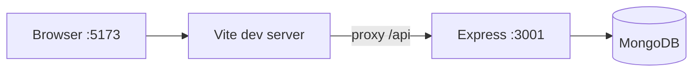

# Architecture

This template is a **monorepo-style layout at the repository root**: the Vite React app (`client/`) and the Express API (`server/`) are siblings. Shared scripts live in the root `package.json` (dev servers, build, lint).

## Layers

| Layer | Location | Role |
|-------|----------|------|
| UI | `client/` | React 18, React Router, Tailwind; calls REST API under `/api` |
| API | `server/` | Express, JSON body parsing, CORS, Helmet; mounts routes under `/api` |
| Data | MongoDB via Mongoose | Models in `server/src/models/` |

## Runtime topology (development)

- The Vite dev server proxies `/api` to `http://localhost:3001` (see `client/vite.config.ts`).
- The client uses `VITE_API_URL` (typically `http://localhost:3001/api`) for direct API base URL where applicable; the proxy keeps same-origin requests simple during dev.

## Authentication

- **Auth0** on the client (`@auth0/auth0-react`) issues JWT access tokens after login.
- The client attaches the token to requests (via `client/src/services/api.ts` patterns).
- The server validates JWTs with Auth0 JWKS (`server/src/middleware/auth.ts`) on protected routes.

Swapping to Shopify or another IdP is a coordinated change: client provider, token acquisition, and server verification middleware.

## Server entry and routes

- Entry: `server/src/index.ts` — loads env, connects MongoDB, registers middleware and route modules.
- Routes are grouped under `/api/*` (for example `/api/users`, `/api/items`, `/api/health`).

## Frontend entry and routing

- Entry: `client/src/main.tsx` → `App.tsx` with React Router.
- Protected UI uses `ProtectedRoute` and Auth0’s authenticated state.

## Configuration

| Concern | Where |
|---------|--------|
| Root env | `.env` (optional; often `NODE_ENV`) |
| Client env | `client/.env` — `VITE_*` variables |
| Server env | `server/.env` — `PORT`, `MONGODB_URI`, Auth0, etc. |

Never commit real secrets; use `.env.example` files as templates.

## Extending the template

1. **New API resource**: add a Mongoose model, a route module under `server/src/routes/`, register it in `server/src/index.ts`, reuse `checkJwt` and `asyncHandler` patterns.
2. **New page**: add a component under `client/src/pages/`, register the route in `client/src/App.tsx`, use `api` from `client/src/services/api.ts` for calls.

For coding conventions and snippets, see the repo root `.cursorrules` and `.cursor/rules/`.
