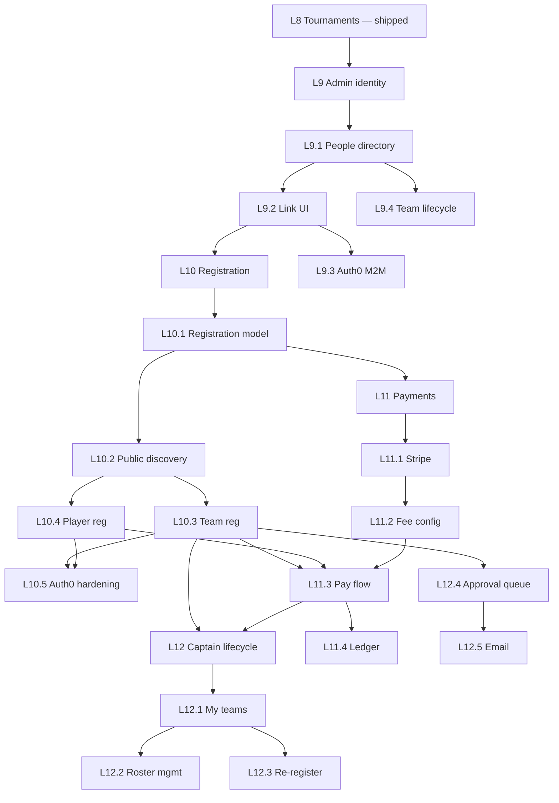

# Leagues — Phase L9–L12 Build Prompts (Registration · Payments · Identity)

**Prerequisite:** Phases **L0–L8** complete ([LEAGUES_BUILD_PROMPTS.md](./LEAGUES_BUILD_PROMPTS.md))  
**Module:** Leagues + tournaments  
**Status:** **Planned** — not started  
**Last updated:** June 2026

Paste the relevant prompt into Cursor chat with **`docs/contexts/CONTEXT_leagues.md`** attached (and `.cursorrules` / `AGENTS.md` as usual).

Each prompt is self-contained: what to build, which files to touch, acceptance criteria.

**Product plan:** [LEAGUES.md](../LEAGUES.md) · **Schemas:** [leagues/SCHEMAS.md](../leagues/SCHEMAS.md) · **Auth:** [SETUP_AUTH0.md](../SETUP_AUTH0.md)

---

## What this expansion covers

| User need | Phase | Summary |
|-----------|-------|---------|
| Admin manages teams, captains, player logins | **L9** | People hub, Auth0 linking, invite/resend, roster ops |
| Public registration + first-time Auth0 accounts | **L10** | Registration windows, team/player signup flows |
| Pay for league or tournament entry | **L11** | Stripe Checkout, webhooks, payment status on registrations |
| Captains manage teams + re-register for new seasons | **L12** | Captain dashboard, roster edits, returning-team flow |

**Branch convention:** `feat/leagues-l{N}-{short-name}`

---

## Quick reference

| Phase | Prompt | What it builds |
|-------|--------|----------------|
| **L9** | L9.1 | Admin **People** directory (players, captains, users) |
| **L9** | L9.2 | User ↔ Player linking UI (replace manual auth0Sub paste) |
| **L9** | L9.3 | Auth0 Management API — send invites, resend, revoke *(env-gated)* |
| **L9** | L9.4 | Admin team lifecycle (transfer captain, roster bulk, remove team) |
| **L10** | L10.1 | Registration settings on League + `Registration` model |
| **L10** | L10.2 | Public registration discovery (`/register`) |
| **L10** | L10.3 | Team registration flow + Auth0 signup |
| **L10** | L10.4 | Individual tournament registration + Auth0 signup |
| **L10** | L10.5 | Auth0 Actions + post-login activation hardening |
| **L11** | L11.1 | Stripe foundation (Checkout + webhooks) |
| **L11** | L11.2 | Entry fee config (admin) |
| **L11** | L11.3 | Pay-at-register flow (team + player) |
| **L11** | L11.4 | Admin payment ledger + waiver/refund |
| **L12** | L12.1 | Captain **My teams** hub (cross-league) |
| **L12** | L12.2 | Captain roster management (within league rules) |
| **L12** | L12.3 | Season re-registration (returning team) |
| **L12** | L12.4 | Waitlist + admin approval queue |
| **L12** | L12.5 | Registration notifications (email) |

**Recommended order:** L9.1 → L9.2 → L10.1 → L10.2 → L10.3 → L10.5 → L11.1 → L11.3 → L12.1 → L12.3.  
L9.3 (Management API) and L11.4 can ship after core flows work.

---

## Auth0 integration — standard steps (read before L9–L12)

Tavern Base already uses **one Auth0 SPA + one API** for staff, captains, and players. Registration expands that model — it does **not** require separate Auth0 applications per role.

### Architecture (keep this)

```
Identity     → Auth0 (who are you?)
Authorization → MongoDB User.role + Player/Team links (what can you do?)
```

| Role | Login route | Activation endpoint | MongoDB link |
|------|-------------|---------------------|--------------|
| `manager` / `staff` / `league_admin` | `/admin/login` | Seed script only (staff pre-provisioned) | `User { auth0Sub, role }` |
| `captain` | `/captain/login` | `POST /api/captain/activate` | `User` + `Player.auth0Sub` |
| `player` | `/player/login` | `POST /api/player/activate` | `User` + `Player.auth0Sub` |

### Standard Auth0 setup for self-service registration

**1. Enable sign-up on Universal Login**

- Auth0 Dashboard → **Authentication → Database** → enable **Username-Password-Authentication** (or social connections).
- Application → **Settings** → ensure sign-up is allowed for the SPA.
- Optional: **Customize Universal Login** with venue branding.

**2. Include `email` (and optionally `name`) in access tokens**

- Already required for captain auto-link — extend to all registrants.
- API → **Settings → Token Settings** → add `email` to access token claims (or use Auth0 Action below).

**3. Post-login / post-registration Action (recommended — L10.5)**

Create an Auth0 **Action** on **Login / Post User Registration**:

```javascript
// Pseudocode — Action adds claims; app still calls activate API
exports.onExecutePostLogin = async (event, api) => {
  if (event.user.email) {
    api.accessToken.setCustomClaim('email', event.user.email);
  }
  if (event.user.name) {
    api.accessToken.setCustomClaim('name', event.user.name);
  }
};
```

The React app **still** calls `POST /api/captain/activate` or `/api/player/activate` (or new `/api/register/activate`) after redirect — do not trust role assignment from Auth0 alone.

**4. Sign-up redirect from registration screens**

```typescript
loginWithRedirect({
  authorizationParams: {
    screen_hint: 'signup', // new users see Create Account
    login_hint: email,     // optional pre-fill from registration form
  },
  appState: { returnTo: '/register/team/abc123/complete' },
});
```

**5. Auth0 Management API (optional — L9.3)**

For **admin-initiated** invites (staff creates captain before first login):

- Create **Machine-to-Machine** application.
- Grant scopes: `create:users`, `read:users`, `update:users`, `create:user_tickets` (password reset).
- Env: `AUTH0_MGMT_CLIENT_ID`, `AUTH0_MGMT_CLIENT_SECRET`, `AUTH0_MGMT_DOMAIN`.
- Server sends invite OR creates user with temporary password — user completes at Universal Login.
- On first login, existing `activateCaptainFromAuth` links `auth0Sub` by email.

**6. Email verification (recommended before paid registration — L10.5)**

- Auth0 Dashboard → **Authentication → Database → Requires Verification**.
- Registration API rejects `pending_payment` until `email_verified` claim is true (or check via Management API once).

**7. What Auth0 does *not* do**

- League rosters, team names, divisions, payments — all MongoDB + Stripe.
- Do not store entry fees or roster in Auth0 `app_metadata` except optional `{ establishmentSlug }` for multi-tenant debugging.

**8. Production checklist (extend SETUP_AUTH0.md in L10.5)**

- Add `/register/*`, `/captain/*`, `/player/*` to SPA callback/logout/web origins.
- Rate-limit public registration endpoints.
- Document: staff vs self-service captain/player onboarding paths.

---

## PHASE L9: Admin Identity & Roster Management

**Goal:** Managers and `league_admin` users can manage players, captains, teams, and Auth0-linked accounts without seed scripts or JWT paste.

**Estimated time:** 8–12 hours total  
**Branch:** `feat/leagues-l9-admin-people`

**Builds on (already shipped):**

- `POST /api/admin/leagues/:leagueId/teams/:teamId/invite-captain` — email template only
- `POST /api/admin/leagues/captain-users` / `player-users` — manual auth0Sub link
- League detail roster UI on `LeagueDetailPage.tsx`

---

### Prompt L9.1 — Admin People directory

```
Prerequisite: L0–L8 shipped.

Staff need a venue-wide view of league participants and their login status — not buried per league.

1. CREATE server/src/routes/leagues/people.ts (or extend admin.ts):
   GET /api/admin/leagues/people
   Query: ?q=search&role=captain|player|unlinked&sport=pool&page=1
   Returns paginated:
     - Player { _id, name, email, auth0Sub?, establishmentSlug }
     - roles: captain | player | none (from User lookup)
     - teams: [{ teamId, teamName, leagueId, leagueName, isCaptain }]
     - loginStatus: 'linked' | 'invited' | 'unlinked'

2. CREATE client/src/pages/admin/LeaguePeoplePage.tsx:
   Route: /admin/leagues/people
   - Search by name/email
   - Filters: sport, login status, captain vs player
   - Table: Name, Email, Teams, Login status, Last invite date
   - Row actions: "View teams", "Invite", "Link login" (L9.2)

3. UPDATE admin sidebar — "People" under Leagues section
   Visible to manager + league_admin

4. UPDATE AGENTS.md + SCHEMAS.md — no new models; document query shape

Acceptance criteria:
- Manager sees all players across leagues in one searchable list
- Unlinked captains (email set, no auth0Sub) show "Invited" or "Unlinked"
- league_admin can access; staff read-only optional (403 on POST actions)
```

---

### Prompt L9.2 — Admin User ↔ Player linking UI

```
Prerequisite: L9.1.

Replace manual auth0Sub paste in LeagueDetailPage with guided linking.

1. CREATE POST /api/admin/leagues/people/:playerId/link-login
   Body: { mode: 'invite' | 'manual', auth0Sub?: string, email?: string, role: 'captain' | 'player' }
   - invite: upsert User { email, role, playerId } WITHOUT auth0Sub placeholder — use temp sentinel OR 
     separate PendingInvite collection (preferred):
       PendingInvite { playerId, email, role, invitedAt, invitedBy }
   - manual: existing captain-users/player-users logic (manager only)

2. CREATE DELETE /api/admin/leagues/people/:playerId/link-login
   - Remove User record for playerId (captain/player roles only)
   - Clear Player.auth0Sub
   - Never delete manager/staff users

3. UPDATE LeagueDetailPage + LeaguePeoplePage:
   - "Link login" modal: Invite by email (default) OR Advanced: paste auth0Sub
   - Show linked Auth0 email + role badge
   - Captain row: disable "Invite captain" when already linked; show "Resend invite" (L9.3)

4. VALIDATION:
   - Player must be on a team roster (player role) OR team captain (captain role)
   - One User per playerId per role type

Acceptance criteria:
- Manager can invite/link without editing .env or seed scripts
- Manual auth0Sub path still works for edge cases
- Unlink returns player to "unlinked" state; captain cannot log in until re-linked
```

---

### Prompt L9.3 — Auth0 Management API (env-gated invites)

```
Prerequisite: L9.2.

Optional but production-ready invite sending. Skip if env vars absent — fall back to copy/paste email template (current behavior).

1. CREATE server/src/services/auth0/managementApi.ts:
   - getManagementToken() — client credentials
   - createAuth0User({ email, name, connection: 'Username-Password-Authentication' })
   - sendPasswordResetTicket(email) — acts as invite link
   - getUserByEmail(email)

2. UPDATE POST invite-captain + POST link-login (mode: invite):
   - If AUTH0_MGMT_* configured: create/find Auth0 user, send ticket email via Auth0
   - Else: return { emailSubject, emailBody } as today

3. ADD POST /api/admin/leagues/people/:playerId/resend-invite

4. UPDATE docs/SETUP_AUTH0.md — M2M app setup, scopes, env vars

5. SECURITY:
   - Never expose Management API token to client
   - Rate-limit invite endpoints (5/hour per player)

Acceptance criteria:
- With M2M env configured, invite sends Auth0 email automatically
- Without env, existing manual email template still works
- Captain first login still flows through activateCaptainFromAuth by email match
```

---

### Prompt L9.4 — Admin team lifecycle operations

```
Prerequisite: L9.1.

Managers need full team CRUD beyond per-league detail page basics.

1. ADD admin routes:
   PATCH /api/admin/leagues/:leagueId/teams/:teamId/transfer-captain
     Body: { newCaptainPlayerId }
   POST /api/admin/leagues/:leagueId/teams/:teamId/players
     Body: { playerId } | { name, email } — add existing or create+add
   DELETE /api/admin/leagues/:leagueId/teams/:teamId/players/:playerId
     — block if player is captain (must transfer first)
   DELETE /api/admin/leagues/:leagueId/teams/:teamId
     — block if team has non-scheduled matches; else cascade remove from division

2. UPDATE LeagueDetailPage teams section:
   - Transfer captain dropdown (roster members)
   - Remove player with confirm
   - Delete team with confirm

3. AUDIT: log team delete and captain transfer to console or future AuditLog (@planned)

Acceptance criteria:
- Manager can transfer captain without re-creating team
- Cannot delete team with finalized matches
- Player removed from roster loses team-scoped captain portal access for that team
```

---

## PHASE L10: Registration & Self-Service Onboarding

**Goal:** New players and teams can register for open leagues/tournaments via the public site, creating Auth0 accounts on first visit.

**Estimated time:** 12–16 hours  
**Branch:** `feat/leagues-l10-registration`

**Depends on:** L9.2 (admin can fix failed links); L10.5 depends on Auth0 dashboard access.

---

### Prompt L10.1 — Registration settings + Registration model

```
Prerequisite: L8 shipped.

1. EXTEND ILeague (SCHEMAS.md first):
   registration: {
     enabled: boolean;              // default false
     opensAt?: Date;
     closesAt?: Date;
     entryFeeCents?: number;        // 0 = free; payment in L11
     currency: 'usd';               // default 'usd'
     maxEntrants?: number;          // teams OR players depending on entrantType
     requiresApproval: boolean;     // default false — auto-approve when paid/free
     waiverText?: string;           // checkbox snapshot on submit
   }

2. CREATE server/src/models/leagues/Registration.ts:
   {
     leagueId, divisionId?,
     entrantType: 'team' | 'player',
     status: 'draft' | 'pending_payment' | 'pending_approval' | 'approved' | 'waitlisted' | 'rejected' | 'cancelled',
     submittedByPlayerId: ObjectId,  // captain or self
     teamId?: ObjectId,              // set on approve (team) or created
     playerIds?: ObjectId[],         // roster snapshot at submit
     teamName?: string,              // team registration
     waiverAccepted: boolean,
     waiverTextSnapshot: string,
     paymentId?: ObjectId,           // L11
     reviewedBy?: ObjectId,
     reviewedAt?: Date,
     notes?: string,
   }
   Indexes: { leagueId, status }, { submittedByPlayerId }

3. ADD admin UI on LeagueDetailPage — "Registration" panel:
   - Toggle enabled, dates, max entrants, fee (display only until L11), approval toggle
   - List registrations by status

4. Public API: GET /api/leagues/:id/registration — public fields only (enabled, opens/closes, fee display, spots remaining)

Acceptance criteria:
- League can be marked registration-open without affecting existing rosters
- Registration model created; no public submit yet
- Draft leagues hidden from public registration list
```

---

### Prompt L10.2 — Public registration discovery

```
Prerequisite: L10.1.

1. CREATE client/src/pages/public/RegisterPage.tsx — route /register
   - Lists leagues where registration.enabled && status === 'active' && within date window
   - Cards: sport, kind (league/tournament), entrantType, fee, spots left, closes date
   - CTA: "Register as team" | "Register as player" → auth-gated flow (L10.3/L10.4)

2. CREATE client/src/pages/public/RegisterLeaguePage.tsx — /register/:leagueId
   - League summary + eligibility rules (plain English)
   - If not logged in: "Sign in or create account" → Auth0 with screen_hint signup
   - If logged in: show registration form stub (completed in L10.3/4)

3. ADD GET /api/leagues/registration-open — list leagues accepting registrations

4. UPDATE homepage LeaguesSection — optional "Registration open" link when any league open

5. Empty state: friendly panel when no registrations open (not an error)

Acceptance criteria:
- Public can browse open registrations without admin access
- Closed/full leagues do not appear (or show "Full" disabled)
- Mobile-friendly cards matching pub design system
```

---

### Prompt L10.3 — Team registration flow

```
Prerequisite: L10.2, L9.2.

Captain creates Auth0 account (or logs in), submits team registration for approval/payment.

1. CREATE POST /api/register/team/:leagueId
   Auth: JWT + captain OR player who will become captain
   Body: {
     divisionId?, teamName, roster: [{ name, email }], waiverAccepted: true
   }
   - Create/find Player records for roster emails (establishmentSlug scoped)
   - Create Registration { status: pending_payment | pending_approval | approved }
   - If requiresApproval: pending_approval; else approved → create Team + link players (L10.1 rules)
   - Set submittedByPlayerId to current user's Player id
   - Create User role upgrade: if registrant was player, promote to captain for this flow OR require captain role at login

2. CREATE client/src/pages/public/RegisterTeamPage.tsx — /register/:leagueId/team
   Steps: (1) Team name (2) Add roster rows (3) Waiver checkbox (4) Review → Submit
   After submit: redirect to payment (L11) or "Pending approval" screen

3. EXTEND POST /api/captain/activate:
   - Allow activation when PendingInvite OR Registration exists for email (not only pre-assigned captain)
   - New helper: resolveRegistrationCaptain(email)

4. BLOCK: duplicate team name in division; roster min size (configurable, default 3); max size

Acceptance criteria:
- New user: Auth0 signup → activate → complete team form → registration record created
- Returning captain: login → register new team for new season
- Admin sees pending registration on LeagueDetailPage
```

---

### Prompt L10.4 — Individual player tournament registration

```
Prerequisite: L10.2.

For entrantType === 'player' leagues (tournaments).

1. CREATE POST /api/register/player/:leagueId
   Auth: JWT required
   Body: { waiverAccepted: true }
   - Link authenticated Player to Registration
   - If division.playerIds would exceed maxEntrants → waitlisted
   - On approve: append playerId to Division.playerIds (seed order = registration order)

2. CREATE client/src/pages/public/RegisterPlayerPage.tsx — /register/:leagueId/player
   - Single-player form: confirm name/email from profile, waiver, submit
   - Auth0 signup for new users via /player/login with returnTo

3. EXTEND POST /api/player/activate:
   - Allow self-registration when league registration open (create Player if email not found — name from Auth0)

4. Admin: approve/reject/waitlist on registration row

Acceptance criteria:
- Player can register for 9-ball / 501 / singles volleyball KO without staff creating roster first
- Waitlist when full; admin can promote waitlist to approved
- Bracket schedule generate still requires ≥2 approved players
```

---

### Prompt L10.5 — Auth0 post-registration hardening

```
Prerequisite: L10.3 or L10.4.

1. DOCUMENT in docs/SETUP_AUTH0.md — full registration path:
   - Universal Login sign-up
   - screen_hint + appState returnTo pattern
   - Email verification requirement before paid submit
   - M2M vs self-service decision tree

2. IMPLEMENT Auth0 Action docs + optional claim enrichment (see Auth0 section above)

3. ADD server middleware requireEmailVerified:
   - Read email_verified from JWT if present; else allow (backward compat)
   - Apply to POST /api/register/*

4. UPDATE CaptainLoginPage + PlayerLoginPage copy for self-registrants

5. ADD integration test or script: registration → activate → submit (mock JWT)

Acceptance criteria:
- SETUP_AUTH0.md enables a new developer to configure registration without chat history
- Unverified email blocked from paid registration (when claim present)
- Existing invited captains unaffected
```

---

## PHASE L11: Payments (Stripe)

**Goal:** Players and captains pay entry fees during registration; managers see payment status.

**Estimated time:** 10–14 hours  
**Branch:** `feat/leagues-l11-payments`

**Open decision:** Stripe Connect (venue payouts) vs Stripe Checkout on venue account — default **Checkout on venue Stripe account** for v1; Connect in L11.4 if needed.

---

### Prompt L11.1 — Stripe foundation

```
Prerequisite: L10.1.

1. ADD env vars (server/.env.example):
   STRIPE_SECRET_KEY=
   STRIPE_WEBHOOK_SECRET=
   STRIPE_PUBLISHABLE_KEY=        # client
   STRIPE_SUCCESS_URL=            # /register/payment/success
   STRIPE_CANCEL_URL=

2. CREATE server/src/services/payments/stripe.ts:
   - createCheckoutSession({ registrationId, amountCents, currency, customerEmail, metadata })
   - constructWebhookEvent(rawBody, signature)

3. CREATE server/src/models/leagues/Payment.ts:
   {
     registrationId, leagueId,
     provider: 'stripe',
     stripeSessionId, stripePaymentIntentId?,
     amountCents, currency,
     status: 'pending' | 'paid' | 'failed' | 'refunded' | 'waived',
     paidAt?, refundedAt?,
   }

4. CREATE POST /api/webhooks/stripe — raw body parser, verify signature
   - checkout.session.completed → Payment paid → Registration approved (if auto-approve)

5. SECURITY: webhook route exempt from JSON parser; idempotent on event id

Acceptance criteria:
- Test mode checkout session creates successfully
- Webhook updates Payment + Registration in dev (Stripe CLI)
- No card data touches our servers (Checkout hosted)
```

---

### Prompt L11.2 — Entry fee configuration (admin)

```
Prerequisite: L11.1.

1. UPDATE admin Registration panel:
   - entryFeeCents input ( dollars UI → cents server-side )
   - Preview: "Players will pay $25.00 at registration"
   - Free league: hide payment steps in registration flow

2. VALIDATION:
   - fee >= 0; max 999_999 cents
   - Cannot change fee after registrations exist with pending_payment (or warn manager)

3. Public registration cards show formatted fee

Acceptance criteria:
- Manager sets fee before opening registration
- Free leagues skip Stripe entirely
```

---

### Prompt L11.3 — Pay-at-register flow

```
Prerequisite: L11.1, L10.3, L10.4.

1. UPDATE registration submit handlers:
   - If entryFeeCents > 0: status → pending_payment; return { checkoutUrl }
   - Client redirects to Stripe Checkout
   - On success URL: poll GET /api/register/registrations/:id/status

2. CREATE GET /api/register/registrations/:id — owner-scoped (JWT matches submittedByPlayerId)

3. CREATE POST /api/register/registrations/:id/checkout — retry payment if session expired

4. FLOW:
   free + auto-approve → approved immediately
   free + requiresApproval → pending_approval
   paid + auto-approve → pending_payment → webhook → approved
   paid + requiresApproval → pending_payment → webhook → pending_approval → admin approve

Acceptance criteria:
- Captain completes team registration end-to-end with test card
- Player completes tournament registration with test card
- Abandoned checkout stays pending_payment; can retry
```

---

### Prompt L11.4 — Admin payment ledger + waiver/refund

```
Prerequisite: L11.3.

1. CREATE GET /api/admin/leagues/:leagueId/payments
   - Registrations with payment status, player/team name, amount, date

2. ADD admin actions:
   POST .../registrations/:id/waive-fee — manager only; status → waived, registration approved
   POST .../registrations/:id/refund — call Stripe refund API; status → refunded

3. UPDATE LeaguePeoplePage or Registration list — payment badge column

4. OPTIONAL: Stripe Connect for multi-venue — document in LEAGUES.md @planned

Acceptance criteria:
- Manager can waive fee for comp entry
- Refund updates Payment + optionally cancels Registration
- Payment list exportable (CSV) optional nice-to-have
```

---

## PHASE L12: Captain Team Lifecycle & Re-Registration

**Goal:** Captains manage rosters and register the same team for future seasons without staff re-entry.

**Estimated time:** 8–12 hours  
**Branch:** `feat/leagues-l12-captain-lifecycle`

**Depends on:** L10.3 (registration), L9.4 (admin team ops as fallback)

---

### Prompt L12.1 — Captain "My teams" hub

```
Prerequisite: L10.3.

1. EXTEND GET /api/captain/profile:
   - teams: [{ teamId, teamName, leagueId, leagueName, sport, status, registration }]
   - pastTeams: completed leagues

2. CREATE client/src/pages/captain/CaptainTeamsPage.tsx — /captain/teams
   - List active teams across leagues
   - Links: Submit scores, Manage roster (L12.2), Register for new season (L12.3)

3. UPDATE CaptainLayout nav

Acceptance criteria:
- Captain with multiple teams sees all in one place
- No access to teams they do not captain
```

---

### Prompt L12.2 — Captain roster management

```
Prerequisite: L12.1, L9.4.

Captain can adjust roster between registration and season start (within rules).

1. CREATE captain routes (team-scoped):
   GET /api/captain/teams/:teamId/roster
   POST /api/captain/teams/:teamId/roster — add player { name, email }
   DELETE /api/captain/teams/:teamId/roster/:playerId — not captain self

2. RULES (enforce server-side):
   - Only when league.status === 'draft' || registration window open
   - OR manager enables captainRosterEdits on league.registration
   - Min/max roster size enforced
   - Added players get invite email (L9.3)

3. CREATE client/src/pages/captain/CaptainRosterPage.tsx

Acceptance criteria:
- Captain adds sub before season starts
- Captain cannot remove last player or themselves without transfer
- Changes reflect on admin LeagueDetailPage immediately
```

---

### Prompt L12.3 — Season re-registration (returning team)

```
Prerequisite: L12.1, L10.3, L11.3.

1. ADD Registration.returningTeamId?: ObjectId — links to prior season Team

2. CREATE POST /api/register/team/:leagueId/returning
   Body: { priorTeamId, leagueId (new), rosterChanges?, waiverAccepted }
   - Pre-fill team name + roster from prior Team
   - Captain confirms/edits → normal registration + payment flow

3. UI: /captain/teams → "Register for [2026 Fall Pool]" when registration open on new league
   - Shows prior season roster with checkboxes (who's returning)

4. ADMIN: optionally map "prior league" in registration settings for continuity

Acceptance criteria:
- Returning captain registers in <2 min with pre-filled roster
- New league team created on approval (do not mutate old Team record)
- Historical league data preserved
```

---

### Prompt L12.4 — Waitlist + admin approval queue

```
Prerequisite: L10.3, L10.4.

1. CREATE client/src/pages/admin/RegistrationQueuePage.tsx — /admin/leagues/registrations
   - Filters: pending_approval, waitlisted, pending_payment
   - Bulk approve/reject

2. ADD routes:
   POST /api/admin/leagues/registrations/:id/approve
   POST /api/admin/leagues/registrations/:id/reject — { reason }
   POST /api/admin/leagues/registrations/:id/promote — waitlist → pending_payment or approved

3. On approve (team): create Team, assign division, set captain, attach roster
4. On approve (player): append to Division.playerIds

5. NOTIFY registrant (stub email or L12.5)

Acceptance criteria:
- Manager approves team registration → team appears in league division
- Rejected registration does not create team
- Waitlist promotion respects maxEntrants
```

---

### Prompt L12.5 — Registration notifications (email)

```
Prerequisite: L12.4.

1. CHOOSE provider (document in SETUP.md):
   - Phase 1: structured email templates returned to admin (current captain invite pattern)
   - Phase 2: SendGrid/Resend/Postmark env-gated

2. CREATE server/src/services/notifications/registrationEmail.ts:
   - registrationReceived, registrationApproved, registrationRejected, paymentReceipt

3. TRIGGER on status transitions (server-side hooks in registration service)

4. Admin "Copy email" fallback when provider not configured

Acceptance criteria:
- Registrant receives approval/rejection message (or admin copies template)
- Payment receipt includes amount and league name
- No PII in logs
```

---

## Dependency graph



---

## Open decisions (resolve before corresponding prompt)

| # | Question | Blocks | Default if no answer |
|---|----------|--------|---------------------|
| 10 | Stripe Connect vs direct Checkout? | L11.1 | Direct Checkout on venue Stripe account |
| 11 | Self-reg captains create Auth0 on `/register` or `/captain/login`? | L10.3 | Single `/register/:id/team` flow with signup embedded |
| 12 | Email provider for transactional mail? | L12.5 | Copy/paste templates (like captain invite v1) |
| 13 | Require admin approval for all paid registrations? | L10.1 | Auto-approve when payment succeeds |
| 14 | Captain roster edits after season starts? | L12.2 | Locked once league.status === 'active' |
| 15 | Multi-division registration — pick division at signup? | L10.3 | Single division v1; admin assigns if multiple |
| 16 | Auth0 Organizations per venue? | Post-L12 | Defer — establishmentSlug in MongoDB sufficient |
| 17 | Refund policy — auto-cancel Registration? | L11.4 | Manual admin cancel after refund |
| 18 | Guest checkout without Auth0? | L10 | **No** — Auth0 required for identity + scoresheets |

---

## Schema additions summary (for SCHEMAS.md — implement with L10.1 / L11.1)

```typescript
/** @planned — L10.1 */
interface LeagueRegistrationSettings {
  enabled: boolean;
  opensAt?: Date;
  closesAt?: Date;
  entryFeeCents?: number;
  currency: 'usd';
  maxEntrants?: number;
  requiresApproval: boolean;
  captainRosterEdits?: boolean;
  waiverText?: string;
}

/** @planned — L10.1 */
interface IRegistration {
  leagueId: ObjectId;
  divisionId?: ObjectId;
  entrantType: 'team' | 'player';
  status: 'draft' | 'pending_payment' | 'pending_approval' | 'approved' | 'waitlisted' | 'rejected' | 'cancelled';
  submittedByPlayerId: ObjectId;
  teamId?: ObjectId;
  returningTeamId?: ObjectId;
  playerIds?: ObjectId[];
  teamName?: string;
  waiverAccepted: boolean;
  waiverTextSnapshot: string;
  paymentId?: ObjectId;
  reviewedBy?: ObjectId;
  reviewedAt?: Date;
  notes?: string;
}

/** @planned — L11.1 */
interface IPayment {
  registrationId: ObjectId;
  leagueId: ObjectId;
  provider: 'stripe';
  stripeSessionId?: string;
  stripePaymentIntentId?: string;
  amountCents: number;
  currency: string;
  status: 'pending' | 'paid' | 'failed' | 'refunded' | 'waived';
  paidAt?: Date;
  refundedAt?: Date;
}

/** @planned — L9.2 */
interface IPendingInvite {
  playerId: ObjectId;
  email: string;
  role: 'captain' | 'player';
  invitedBy?: ObjectId;
  invitedAt: Date;
}
```

---

## Public & admin routes (target state after L12)

```
Public
  /register                     → open registration list
  /register/:leagueId           → league registration landing
  /register/:leagueId/team      → team signup (Auth0)
  /register/:leagueId/player    → player signup (Auth0)
  /register/payment/success     → post-Stripe return

Admin (manager | league_admin)
  /admin/leagues/people         → People directory
  /admin/leagues/registrations  → Approval / waitlist queue
  /admin/leagues/:id            → Registration settings + list (existing page)

Captain
  /captain/teams                → My teams hub
  /captain/teams/:id/roster     → Roster management
  /captain                      → Scores (existing)
```

---

## Related docs

| Document | Purpose |
|----------|---------|
| [LEAGUES_BUILD_PROMPTS.md](./LEAGUES_BUILD_PROMPTS.md) | L0–L8 build history |
| [CONTEXT_leagues.md](../contexts/CONTEXT_leagues.md) | Attach to every prompt |
| [SETUP_AUTH0.md](../SETUP_AUTH0.md) | Extend in L9.3, L10.5 |
| [LEAGUES.md](../LEAGUES.md) | Product plan — update after L10 ships |
